# My Certification Projects Portfolio

## Patika Intermediate Frontend Web Development Path Certification Tasks

### Turkish Checkers

Live Demo: <https://turkishcheckers.netlify.app/>
<br>Repository: <https://github.com/cemcelikgh/turkish-checkers>

[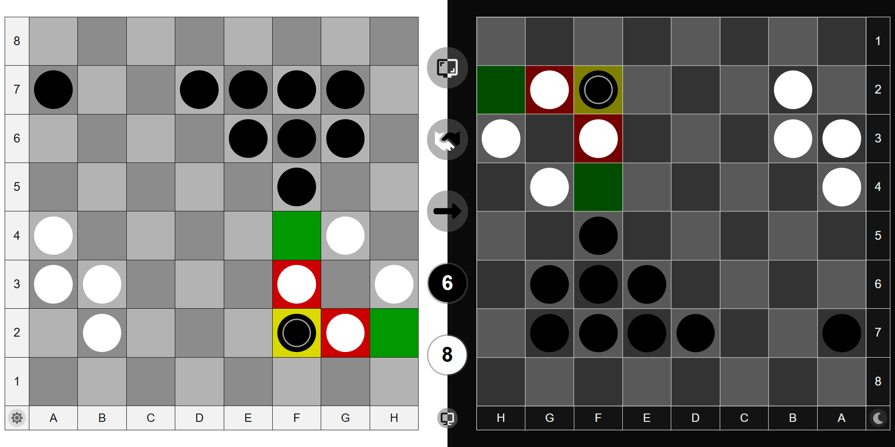](https://turkishcheckers.netlify.app/)

***

### Typing Speed

Live Demo: <https://words-per-minute.netlify.app/>
<br>Repository: <https://github.com/cemcelikgh/typing-speed>

[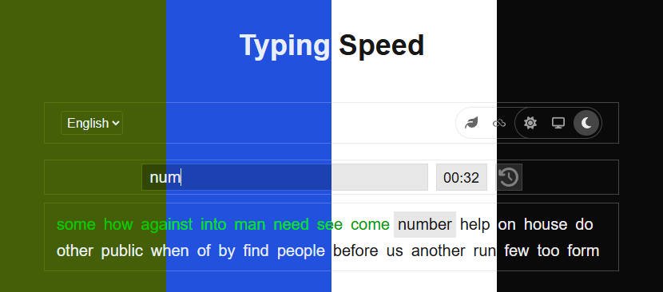](https://words-per-minute.netlify.app/)

***

### Weather Forecast

Live Demo: <https://turkey-weather-forecast.netlify.app/>
<br>Repository: <https://github.com/cemcelikgh/weather_forecast>

[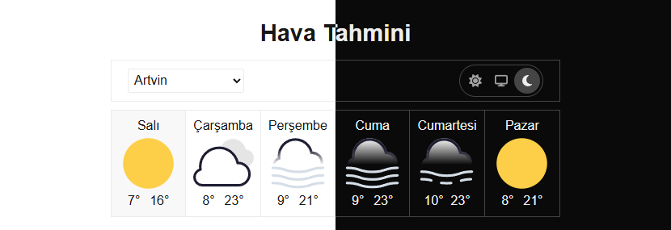](https://turkey-weather-forecast.netlify.app/)

***

### Demographic Status of Countries

Live Demo: <https://demographic-status-of-countries.netlify.app/>
<br>Repository: <https://github.com/cemcelikgh/demographic-status-of-countries>

[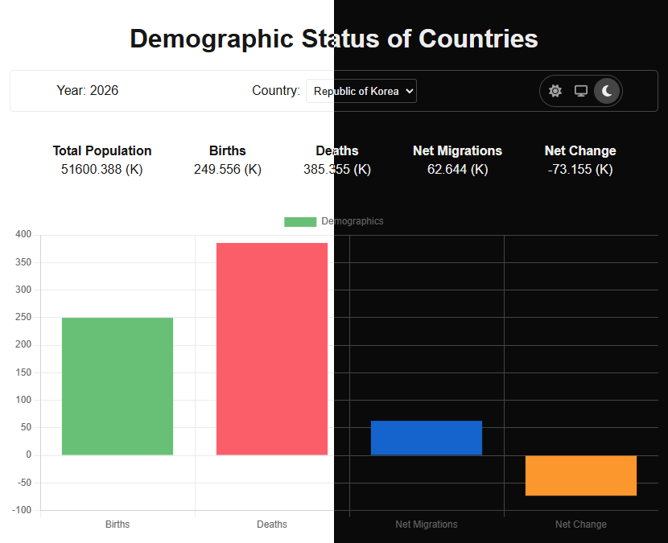](https://demographic-status-of-countries.netlify.app/)

***

### Random Text Generator

Live Demo: <https://rand0m-text-generator.netlify.app/>
<br>Repository: <https://github.com/cemcelikgh/random-text-generator>

[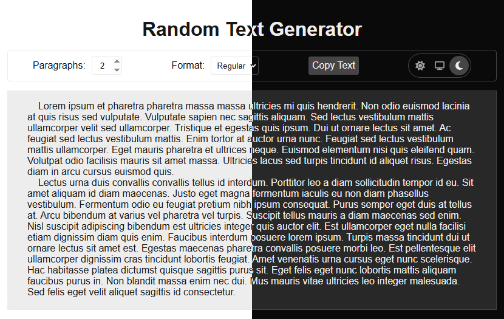](https://rand0m-text-generator.netlify.app/)

***

### Find the Matches

Live Demo: <https://find-the-matches.netlify.app/>
<br>Repository: <https://github.com/cemcelikgh/find-the-matches>

[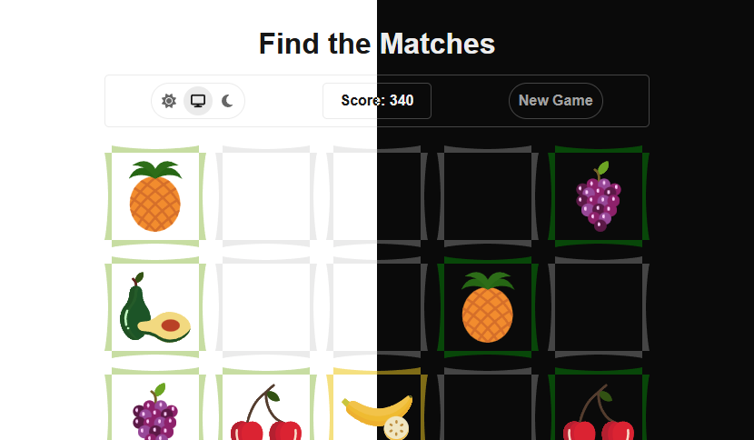](https://find-the-matches.netlify.app/)

***

### Spend 100 Billion Dollars

Live Demo: <https://spend-100-billion-dollars.netlify.app/>
<br>Repository: <https://github.com/cemcelikgh/spend-100-billion-dollars>

[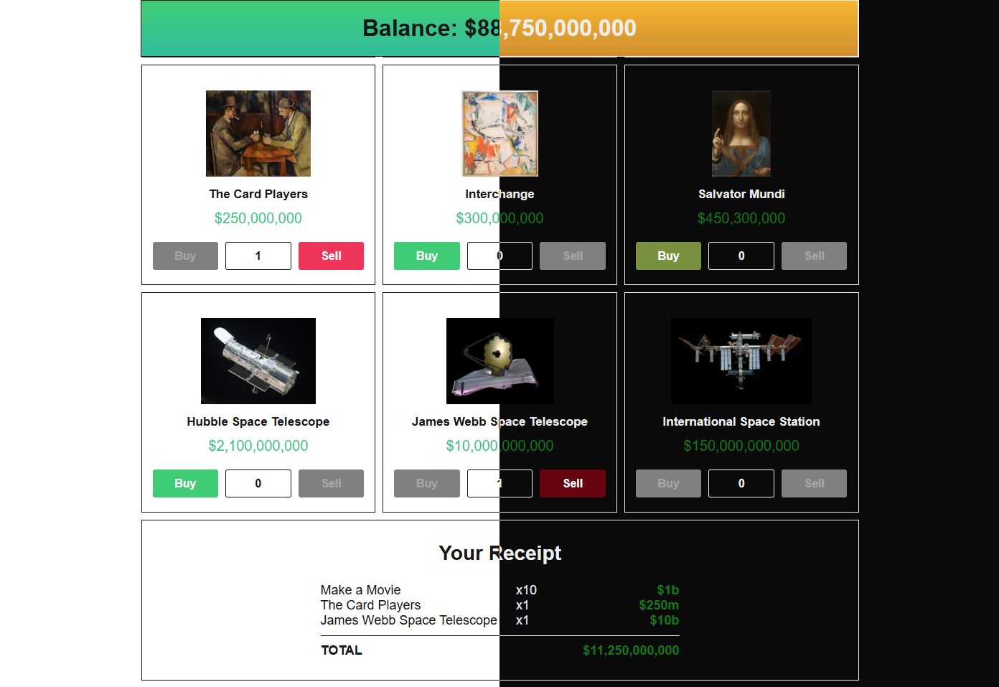](https://spend-100-billion-dollars.netlify.app/)

***

### Notes

Live Demo: <https://colored-notes.netlify.app/>
<br>Repository: <https://github.com/cemcelikgh/notes>

[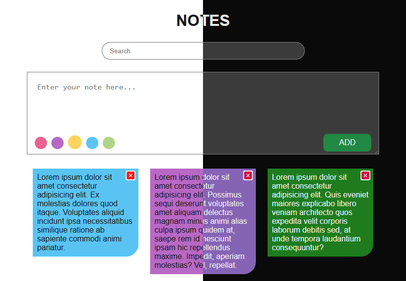](https://colored-notes.netlify.app/)

***

### red-green-blue-buttons

Package: <https://www.npmjs.com/package/red-green-blue-buttons>
<br>Repository: <https://github.com/cemcelikgh/a-npm-package-creating>
<br>Live Example: <https://red-green-blue-buttons.netlify.app/>

<br>[](https://www.npmjs.com/package/red-green-blue-buttons) [](https://standardjs.com)

**Install**

```bash
npm install --save red-green-blue-buttons
```

**Usage**

```jsx
import React, { Component } from 'react';

import Button from 'red-green-blue-buttons';
import 'red-green-blue-buttons/dist/index.css';

class Example extends Component {
  render() {
    return <Button type='green' text='ON' />
  }
}
```

**License**

MIT © [cemcelikgh](https://github.com/cemcelikgh)

***

### App Testing

Repository: <https://github.com/cemcelikgh/app-testing>

```bash
PASS  src/App.test.js
  √ renders without crashing (25ms)
  √ Header should display (25ms)
  √ emoji list should load (15ms)
  √ the searched emoji should filter (22ms)
  √ click event should copy (9ms)

Test Suites: 1 passed, 1 total
Tests:       5 passed, 5 total
Snapshots:   0 total
Time:        2.789s
Ran all test suites.
```

***

### todos

Live Demo: <https://what-needs-to-be-d0ne.netlify.app/>
<br>Repository: <https://github.com/cemcelikgh/todos>

[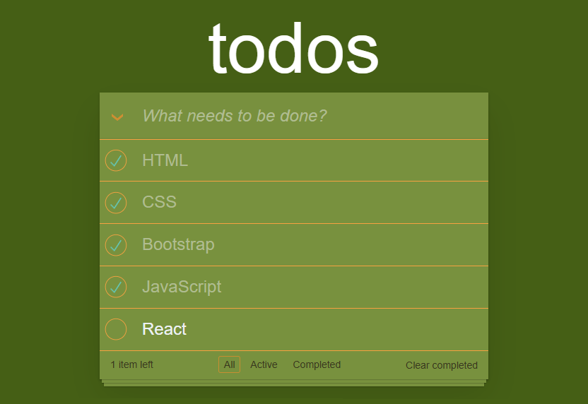](https://what-needs-to-be-d0ne.netlify.app/)

***

## freeCodeCamp Front End Development Libraries Certification Projects

### 25 + 5 Clock

Live Demo: <https://session-and-break-timer.netlify.app/>
<br>Repository: <https://github.com/cemcelikgh/25-plus-5-clock>

[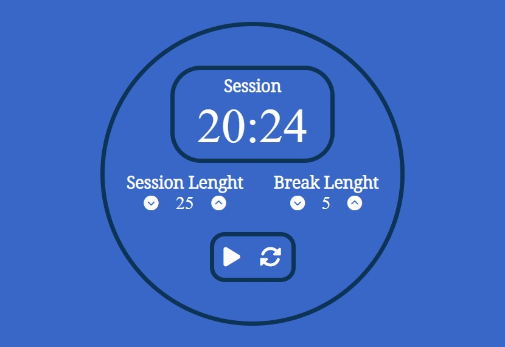](https://session-and-break-timer.netlify.app/)

***

### JavaScript Calculator

Live Demo: <https://javascript-calculating-machine.netlify.app/>
<br>Repository: <https://github.com/cemcelikgh/javascript-calculator>

[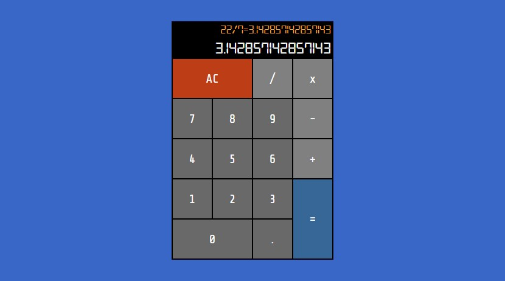](https://javascript-calculating-machine.netlify.app/)

***

### Drum Machine

Live Demo: <https://drum-keyboard.netlify.app/>
<br>Repository: <https://github.com/cemcelikgh/drum-machine>

[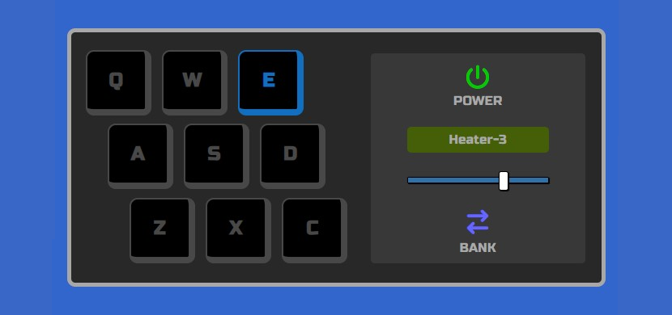](https://drum-keyboard.netlify.app/)

***

### Markdown Previewer

Live Demo: <https://markd0wn-editor.netlify.app/>
<br>Repository: <https://github.com/cemcelikgh/markdown-previewer>

[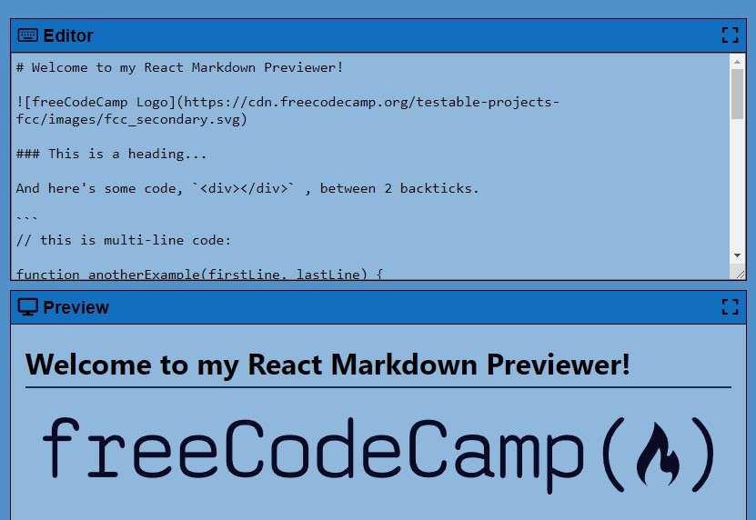](https://markd0wn-editor.netlify.app/)

***

### Random Quote Machine

Live Demo: <https://rand0m-quote-machine.netlify.app/>
<br>Repository: <https://github.com/cemcelikgh/random-quote-machine>

[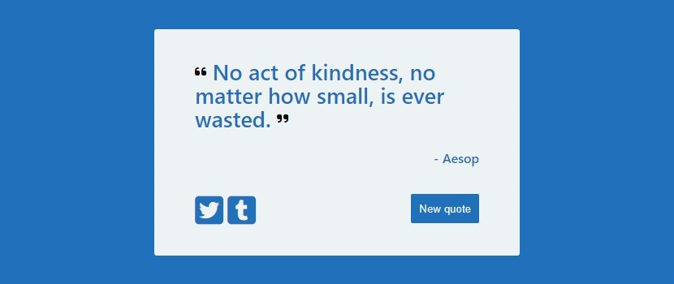](https://rand0m-quote-machine.netlify.app/)

***

## freeCodeCamp JavaScript Algorithms and Data Structures Certification Projects

### Pokémon Search

Live Demo: <https://pocket-monsters-search.netlify.app/>
<br>Repository: <https://github.com/cemcelikgh/pokemon-search>

[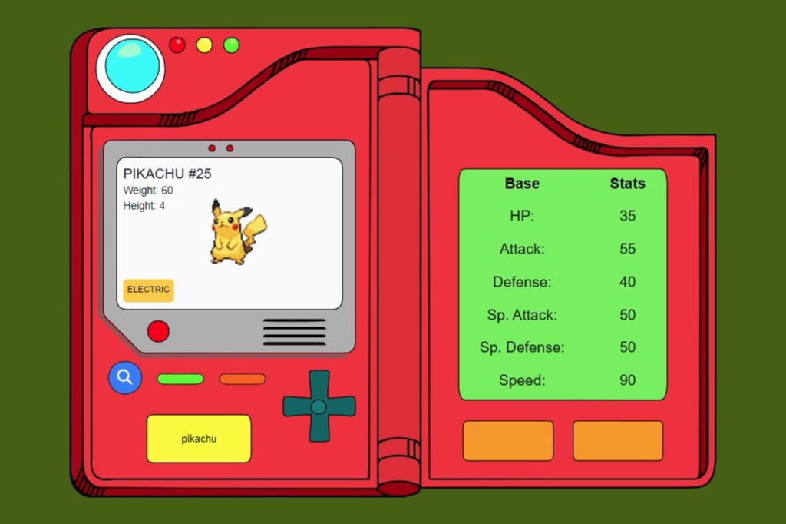](https://pocket-monsters-search.netlify.app/)

***

### Cash Register

Live Demo: <https://cash-till.netlify.app/>
<br>Repository: <https://github.com/cemcelikgh/cash-register>

[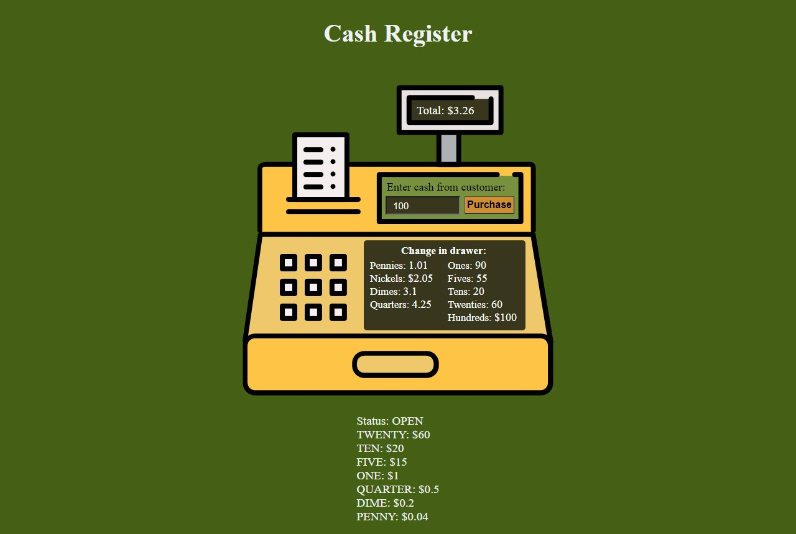](https://cash-till.netlify.app/)

***

### Telephone Number Validator

Live Demo: <https://usa-phone-number-validator.netlify.app/>
<br>Repository: <https://github.com/cemcelikgh/telephone-number-validator>

[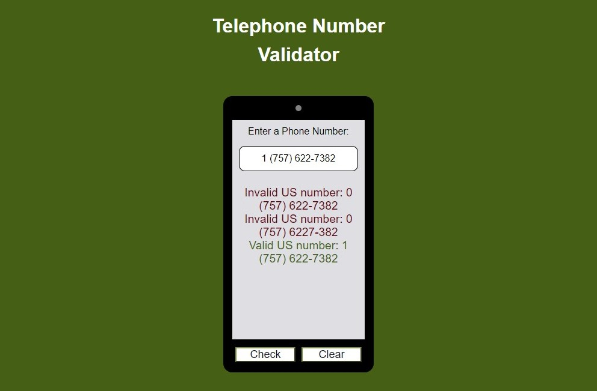](https://usa-phone-number-validator.netlify.app/)

***

### Roman Numeral Converter

Live Demo: <https://arabic-to-roman-numeral-converter.netlify.app/>
<br>Repository: <https://github.com/cemcelikgh/roman-numeral-converter>

[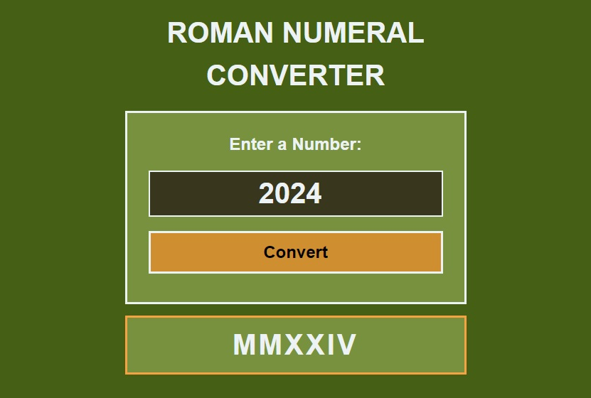](https://arabic-to-roman-numeral-converter.netlify.app/)

***

### Palindrome Checker

Live Demo: <https://is-it-a-palindrome.netlify.app/>
<br>Repository: <https://github.com/cemcelikgh/palindrome-checker>

[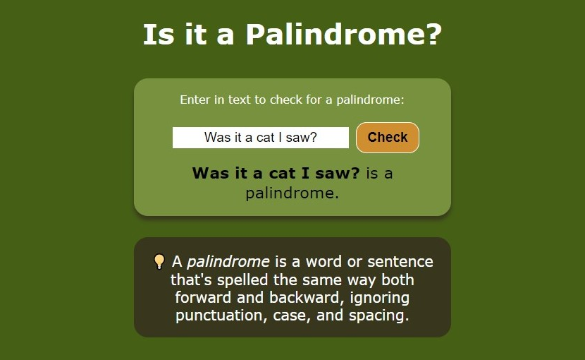](https://is-it-a-palindrome.netlify.app/)

***

## freeCodeCamp Responsive Web Design Certification Projects

### Personal Portfolio Webpage

Live Demo: <https://cemcelikgh.github.io/personal-portfolio-webpage/>
<br>Repository: <https://github.com/cemcelikgh/personal-portfolio-webpage>

[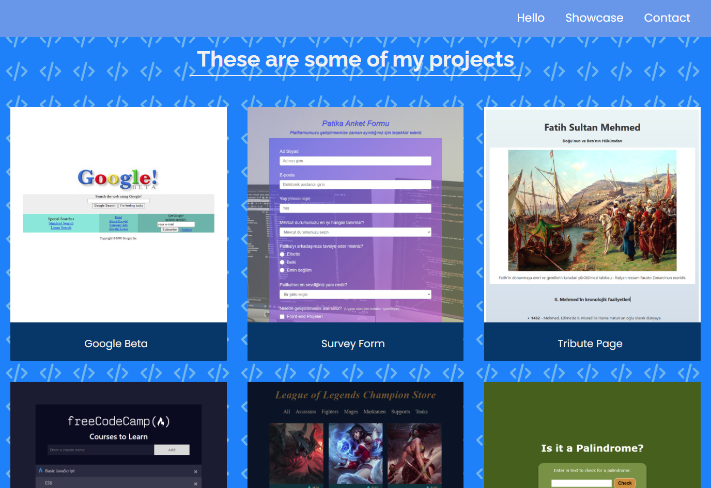](https://cemcelikgh.github.io/personal-portfolio-webpage/)

***

### Product Landing Page

Live Demo: <https://cemcelikgh.github.io/product-landing-page/>
<br>Repository: <https://github.com/cemcelikgh/product-landing-page>

[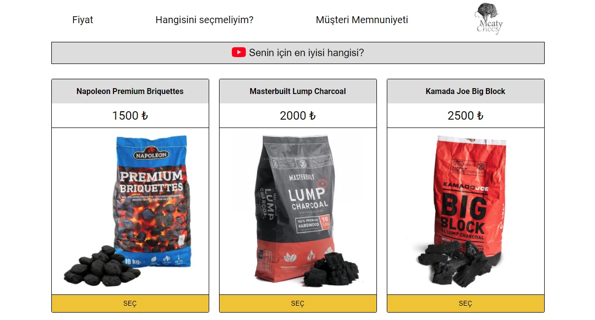](https://cemcelikgh.github.io/product-landing-page/)

***

### Technical Documentation Page

Live Demo: <https://cemcelikgh.github.io/technical-documentation-page/>
<br>Repository: <https://github.com/cemcelikgh/technical-documentation-page>

[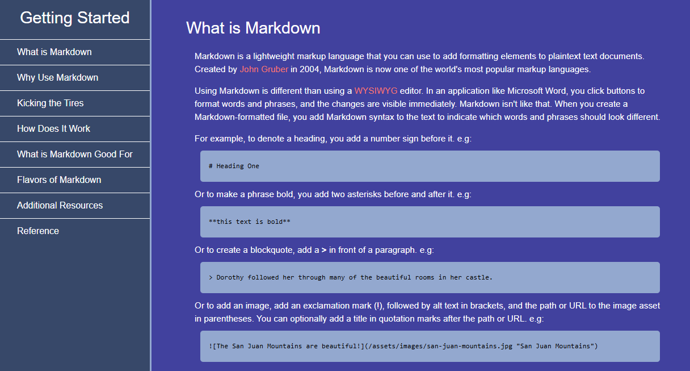](https://cemcelikgh.github.io/technical-documentation-page/)

***

### Tribute Page

Live Demo: <https://cemcelikgh.github.io/tribute-page/>
<br>Repository: <https://github.com/cemcelikgh/tribute-page>

[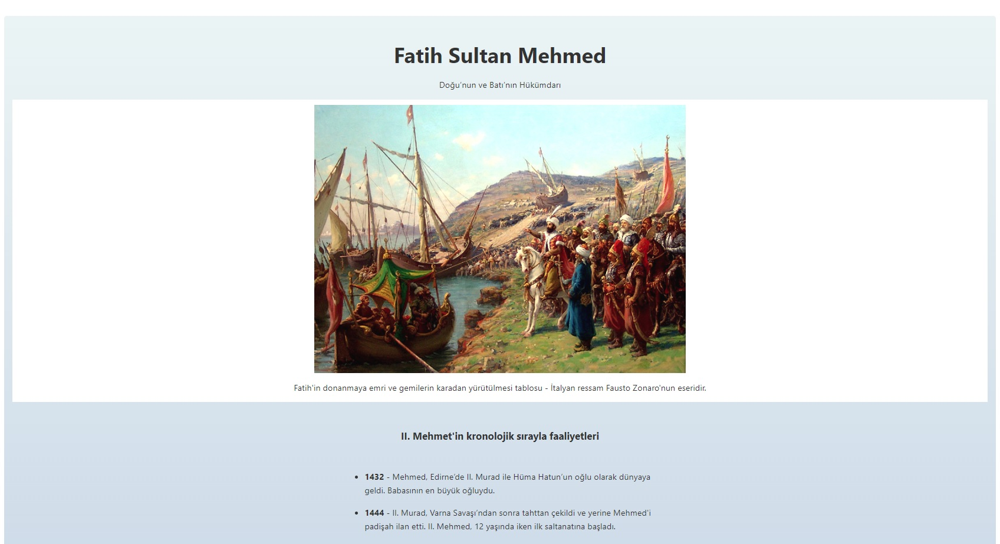](https://cemcelikgh.github.io/tribute-page/)

***

### Survey Form

Live Demo: <https://cemcelikgh.github.io/survey-form/>
<br>Repository: <https://github.com/cemcelikgh/survey-form>

[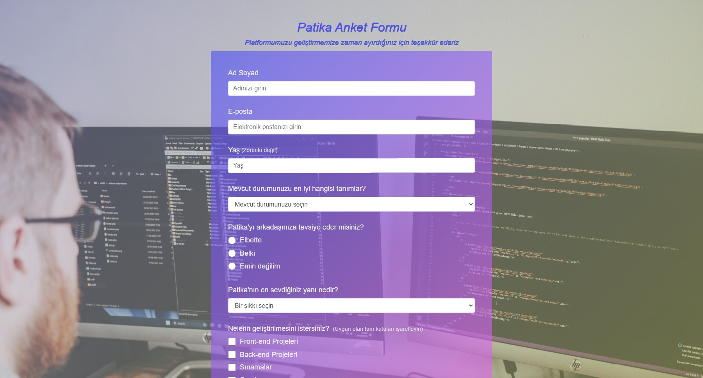](https://cemcelikgh.github.io/survey-form/)

***

## Patika Beginner Frontend Web Development Path Certification Tasks

### League of Legends Champion Store

Live Demo: <https://league-of-legends-champion-store.netlify.app/>
<br>Repository: <https://github.com/cemcelikgh/league-of-legends-champion-store>

[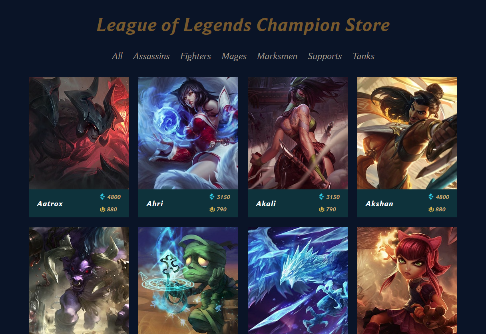](https://league-of-legends-champion-store.netlify.app/)

***

### Courses to Learn

Live Demo: <https://courses-to-learn.netlify.app/>
<br>Repository: <https://github.com/cemcelikgh/courses-to-learn>

[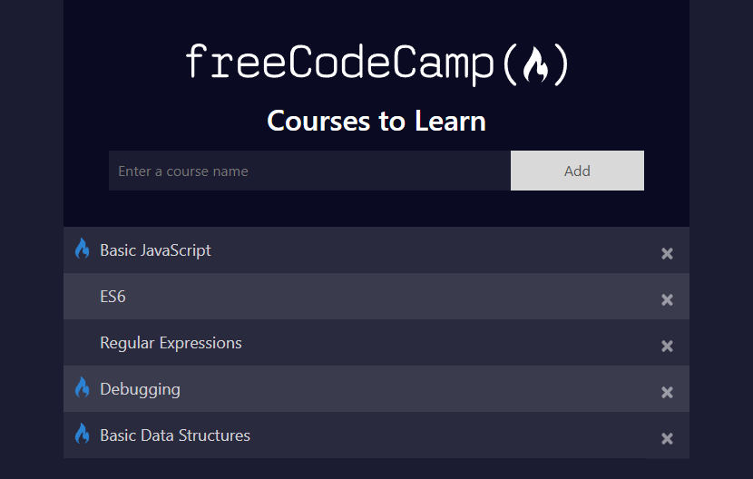](https://courses-to-learn.netlify.app/)

***

### LinkedIn Clone

Live Demo: <https://cemcelikgh.github.io/linkedin-clone/>
<br>Repository: <https://github.com/cemcelikgh/linkedin-clone>

[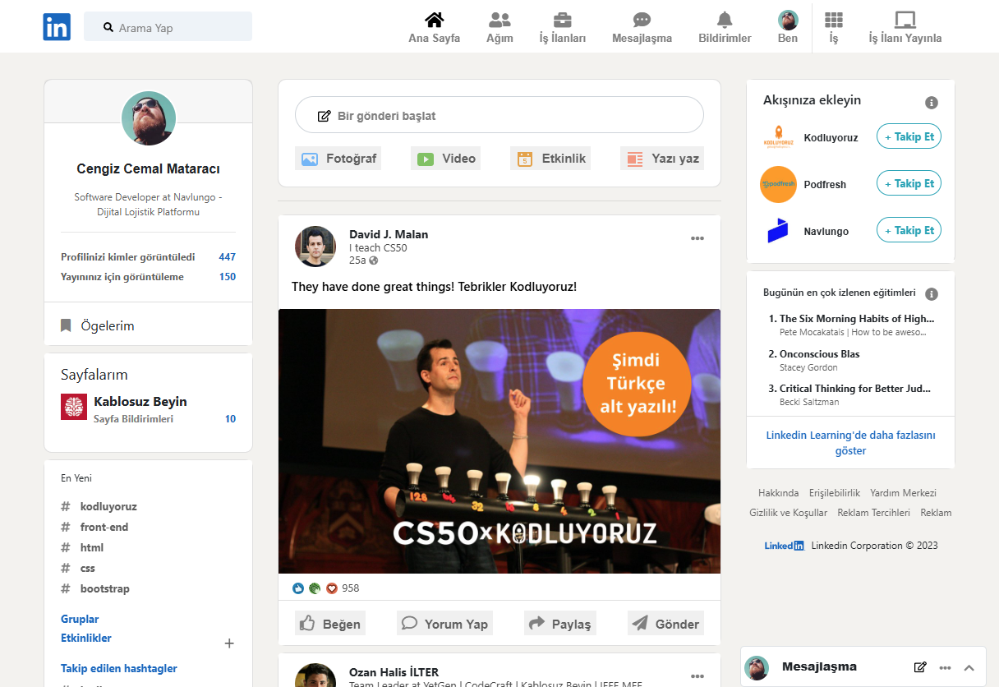](https://cemcelikgh.github.io/linkedin-clone/)

***

### Google Dark Theme

Live Demo: <https://cemcelikgh.github.io/google-dark-theme/>
<br>Repository: <https://github.com/cemcelikgh/google-dark-theme>

[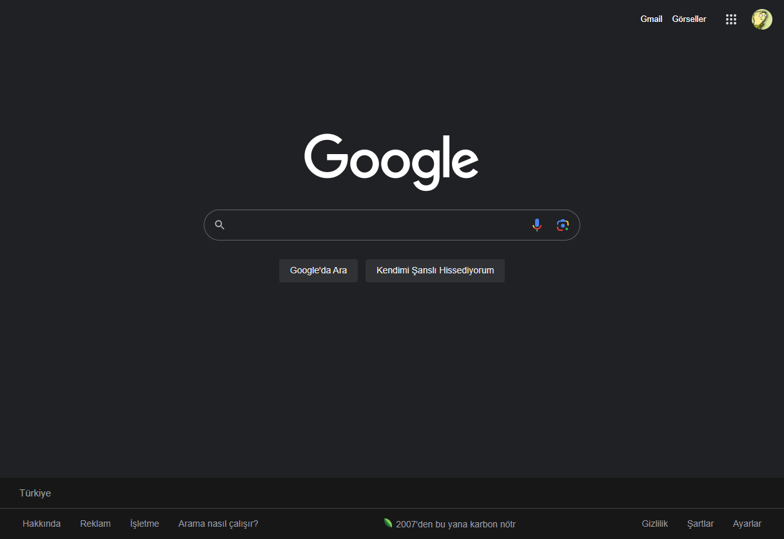](https://cemcelikgh.github.io/google-dark-theme/)

***

### Google Beta

Live Demo: <https://cemcelikgh.github.io/google-beta/>
<br>Repository: <https://github.com/cemcelikgh/google-beta>

[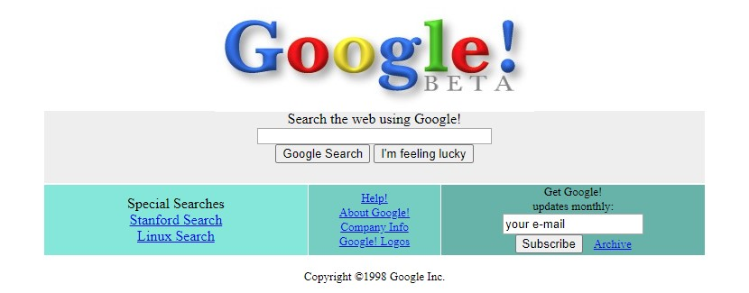](https://cemcelikgh.github.io/google-beta/)

***

### Favorites

Live Demo: <https://cemcelikgh.github.io/favorites/>
<br>Repository: <https://github.com/cemcelikgh/favorites>

[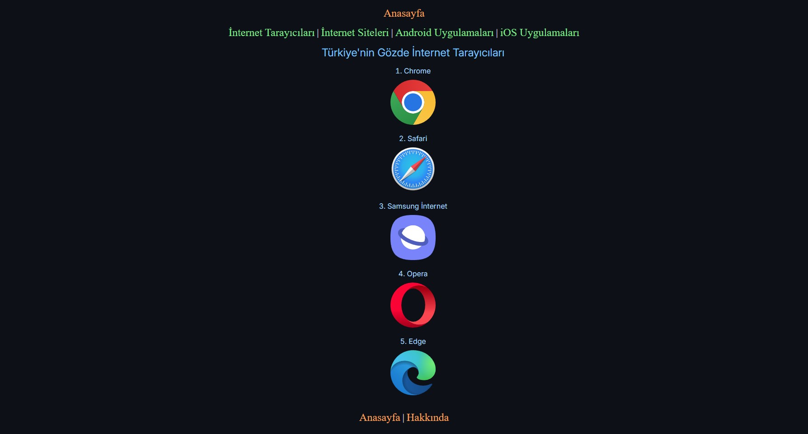](https://cemcelikgh.github.io/favorites/)

***

### Apple Cookies Recipe

Live Demo: <https://cemcelikgh.github.io/apple-cookies-recipe/>
<br>Repository: <https://github.com/cemcelikgh/apple-cookies-recipe>

[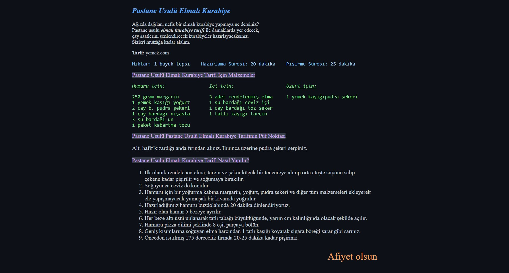](https://cemcelikgh.github.io/apple-cookies-recipe/)

***

### My Favorite Stories

Live Demo: <https://cemcelikgh.github.io/my-favorite-stories/>
<br>Repository: <https://github.com/cemcelikgh/my-favorite-stories>

[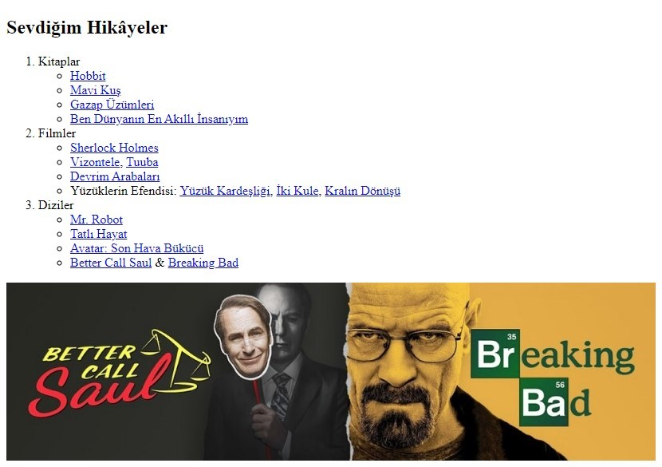](https://cemcelikgh.github.io/my-favorite-stories/)

***

### My First Web Page

Live Demo: <https://cemcelikgh.github.io/my-first-web-page/>
<br>Repository: <https://github.com/cemcelikgh/my-first-web-page>

[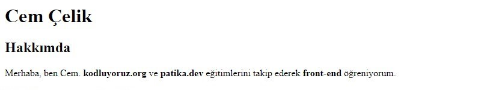](https://cemcelikgh.github.io/my-first-web-page/)

***

### My First Repository

Repository: <https://github.com/cemcelikgh/my-first-repository>

<br>`<html></html>` The HTML code is on the left, and the JavaScript code is below.
```javascript
console.log("Merhaba Dünya");
```

***

![Patika.dev][1]

[1]: ./ui-previews/patika.svg

***

**License**

[MIT](https://choosealicense.com/licenses/mit/)
